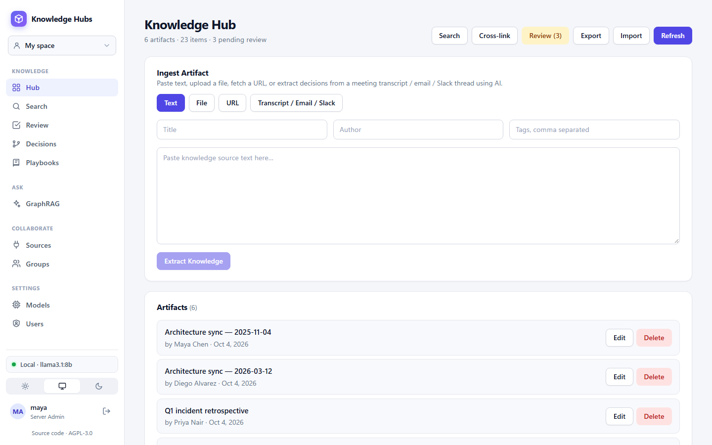
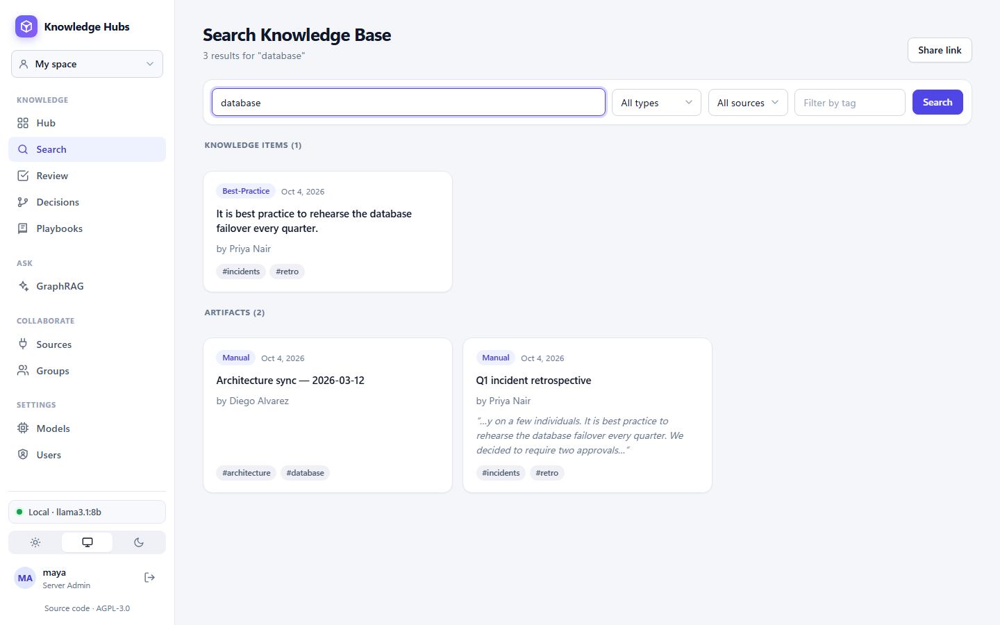
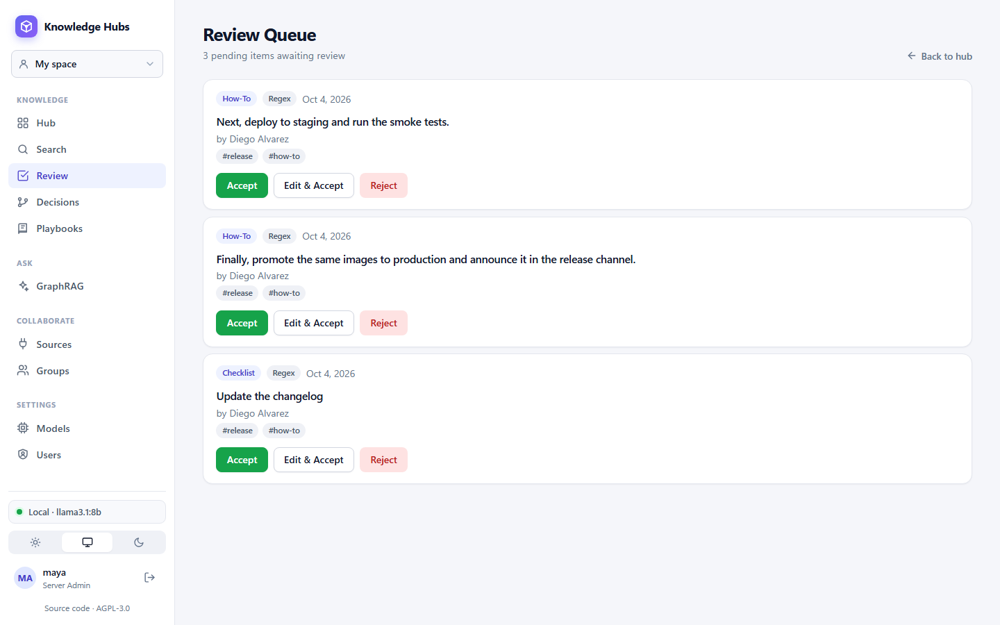
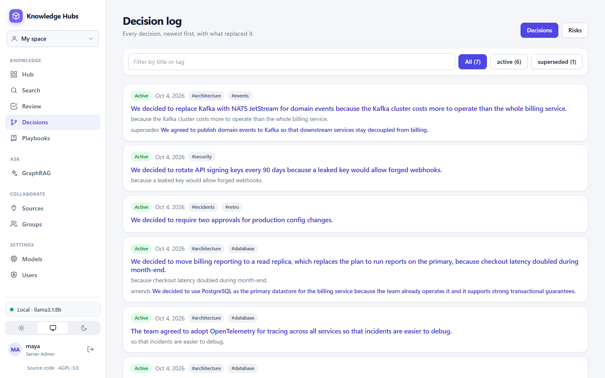
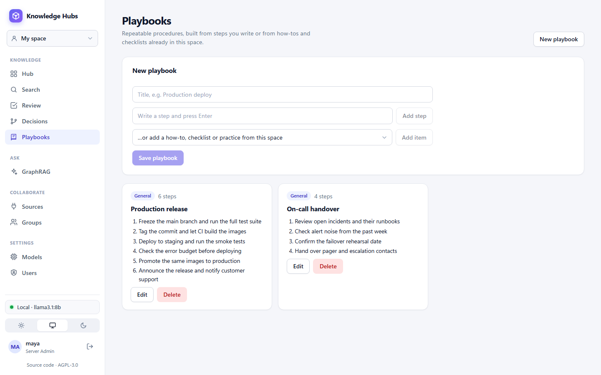
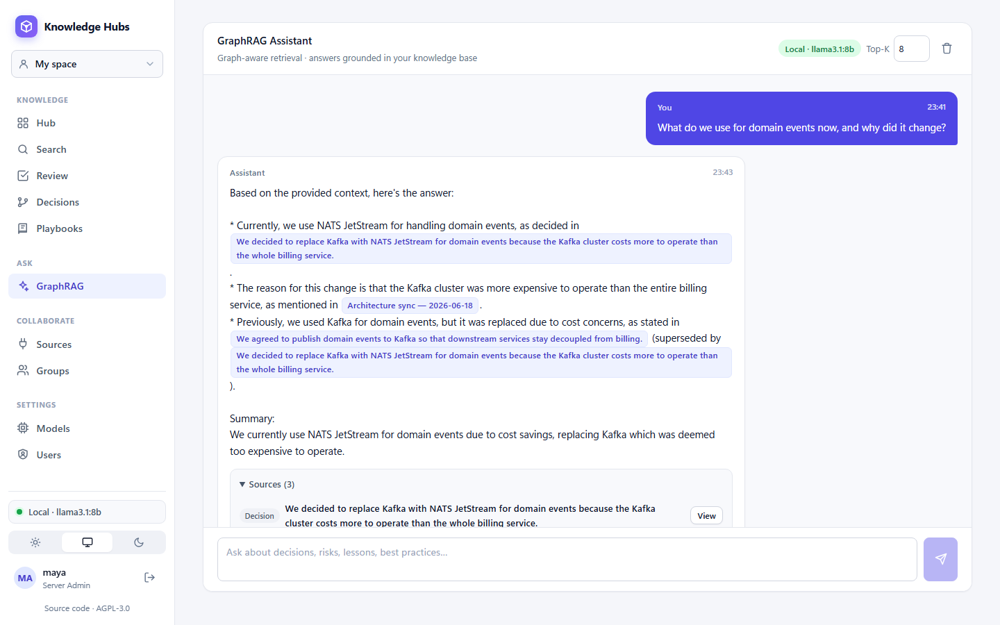
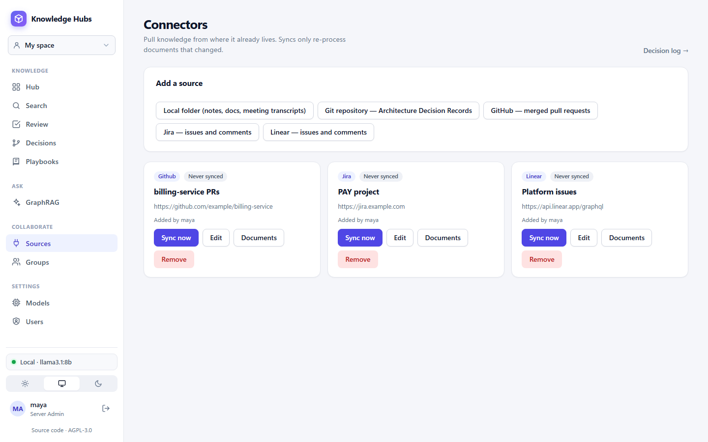
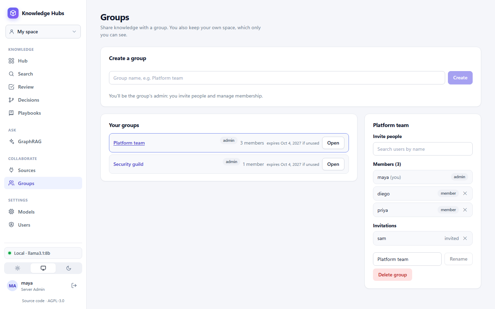
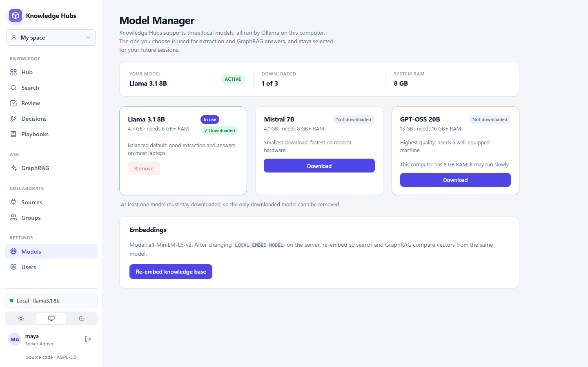
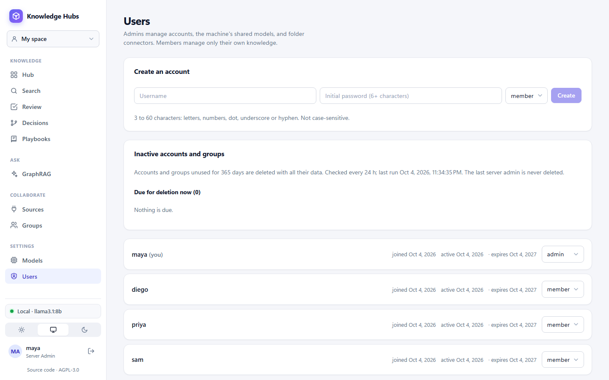

# Screenshots

Every page of the app, in sidebar order. The data is fictional: a demo "Platform team" with a few meeting notes, a retrospective, a release process and a security review. See [Features](features.md) for what each page does.

## Hub

Add knowledge from text, files, URLs or transcripts, and browse everything in the space.

## Search

Full-text search over items and sources, filtered by type, source and tag.

## Review

Extracted items wait here until someone accepts, edits or rejects them. GraphRAG only uses accepted items.

## Decisions

The decision log and risk register, with each item's status and the decision it supersedes or amends.

## Playbooks

Repeatable procedures, written as steps or built from how-tos and checklists in the space.

## GraphRAG

Ask questions in plain English. Answers cite the items they used and point out decisions that were replaced.

## Sources

Connectors for folders, git ADRs, GitHub, Jira and Linear. They sync only when someone clicks **Sync now**.

## Groups

Create groups, invite people and share a space with them.

## Models

Download, switch or remove the local LLMs, and re-embed the knowledge base.

## Users

Server admins create accounts, change roles and see which accounts and groups are due for deletion.

